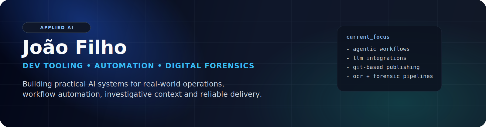

  

<h1 align="center">João Filho</h1>

  <strong>Applied AI • Dev Tooling • Automation • Digital Forensics</strong>

  Construo sistemas práticos com IA para ambientes reais, com foco em rastreabilidade,
  produtividade e integração entre software, operação e contexto investigativo.

  <a href="https://www.linkedin.com/in/profjoaofilho/">LinkedIn</a> •
  <a href="https://www.joaobarbosa.ia.br/">Site</a> •
  <a href="https://www.threads.com/@joaofilhoia">Threads</a> •
  <a href="mailto:joao.the@gmail.com">joao.the@gmail.com</a>

  
  
  
  
  

  
  
  
  
  

---

## Visão

Meu trabalho fica na interseção entre engenharia de software, IA aplicada e automação operacional.
Tenho interesse especial por sistemas úteis e auditáveis: publicação baseada em Git, tooling para agentes,
análise documental, OCR, workflows investigativos e aplicações de IA para o setor público.

Não me interessa demo de tecnologia. O foco é construir fluxos que funcionem sob restrições reais:
contexto incompleto, necessidade de validação, histórico de mudanças e operação contínua.

## Focus Atual

- Tooling e workflows agentic para desenvolvimento assistido por IA
- Integrações entre LLMs, CLIs, MCPs e automação operacional
- Publicação de conteúdo e sites com GitHub, Markdown e Vercel
- Estruturas de conhecimento e operação com Obsidian
- Triagem investigativa, OCR e fluxos forenses com apoio de IA

## Projetos e Frentes

<table>
  <tr>
    <td width="50%" valign="top">
      <strong>🏛️ JBA Desenvolvimento</strong> 
      Consultoria e operação de conteúdo em IA para o setor público, com fluxo de publicação baseado em repositório, Markdown, GitHub e deploy automático na Vercel.
    </td>
    <td width="50%" valign="top">
      <strong>🌿 Digital Garden / joao-filho</strong> 
      Base pública de conhecimento construída com notas em Markdown, GitHub e Vercel, usada como sistema de publicação, autoridade e reaproveitamento de conteúdo.
    </td>
  </tr>
  <tr>
    <td width="50%" valign="top">
      <strong>🕵️ PiauEye</strong> 
      Arquitetura de plataforma de análise forense digital com IA híbrida, automação de ingestão, extração de entidades e organização de evidências para contexto policial brasileiro.
    </td>
    <td width="50%" valign="top">
      <strong>🧭 Agent João</strong> 
      CLI Python sobre a IPED Web API com triagem determinística, banco local de entidades, padrões investigativos e complementação por LLM sob revisão humana.
    </td>
  </tr>
  <tr>
    <td width="50%" valign="top">
      <strong>⚙️ OpenClaw + Linear + Slack Workflow</strong> 
      Orquestração multiagente para ligar contexto, execução, rastreio e comunicação operacional.
    </td>
    <td width="50%" valign="top">
      <strong>📚 Prioridade Técnica</strong> 
      IA aplicada com rastreabilidade, workflows baseados em diff e histórico, e ferramentas que reduzam atrito operacional de verdade.
    </td>
  </tr>
</table>

## Métricas

  
  

---

  Prefiro construir sistemas úteis, verificáveis e adaptáveis a ambientes reais.

